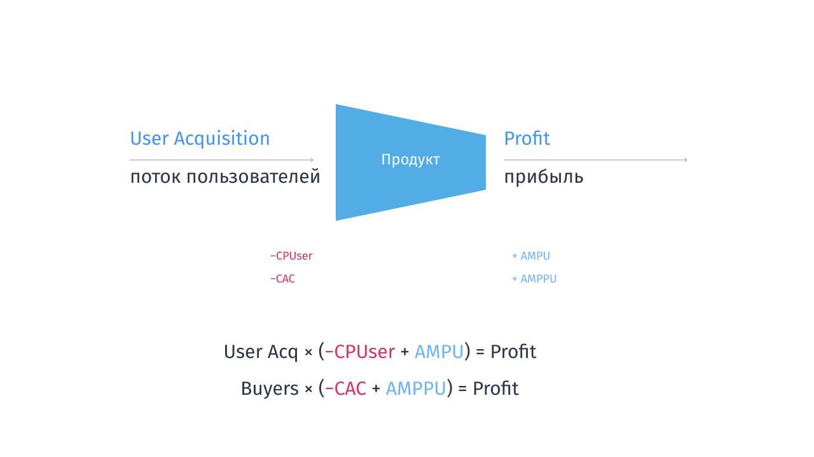
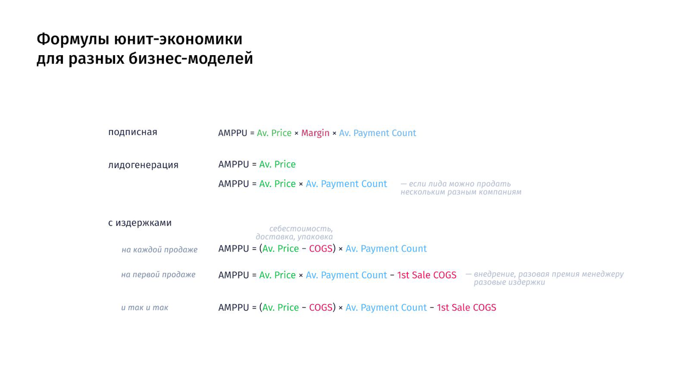

# Глоссарий основных метрик 
и терминов

*Глоссарий — не способ разобраться в юнит-экономике и кейсах, это способ после первых испытаний и воркшопов вернуться к метрикам, когда забыли, что есть что.*
 

- **Связи метрик в экономике и как устроена юнит-экономика**
    
    Экономика устроена просто: на вход продукта подаются пользователи → на выходе получаются деньги
    
    
    
    Для всех бизнес-моделей мы привлекаем пользователей из каких-то каналов (нетворк тоже канал). Делаем им 1-ю продажу и получаем покупателя, который совершает платежи и приносит нам доход. Бизнес-модели отличаются формулой дохода с платящего пользователя AMPPU
    
    
    
    Пользователи приносят доход, а мы несем **масштабируемые издержки:**
    
    - на привлечение (маркетинг) и 1-ю продажу **Acquisition Costs**
    - и на обслуживание клиента после 1-й продажи на время его жизни — Cost of Goods Sold или COGS
    
    **И не масштабируемые**:
    
    - фиксированные Fix Costs — их всегда можно ограничить сверху пределом, поэтому при масштабировании они нас меньше интересуют
    
    
    

# Эти определения и формулы помогут тебе 
в решении кейсов на Испытаниях

<aside>
💡 *дисклеймер:* в разных компаниях одни и те же метрики называются по разному — так вышло: кто-то первый прочитал англоязычные статьи в компании и как разобрался, так дальше и повелось. 

Бывает и так, что сервисы аналитики показывают vanity, бесполезную и ошибочную цифру. Например, большинство сервисов аналитики легко считают **конверсию** *в заказ* — что, конечно, неверно и искажает выводы из метрик (см. ниже) — но не считают **конверсию** *в лида* или **конверсию** *в покупателя,* и команды используют неверные метрики — эти примеры и заблуждения мы так же разберем на курсе.

Например, в командах создающих мобильные приложения долго с примерно 2010 есть путаница с метрикой **CAC Customer Acquisition Cost** использовали в неверном смысле: как **стоимость установки**, которая сейчас правильно называется **CPInstal, Cost per Install** — потому что так повелось, после многие продакты и маркетологи переучивались.

</aside>

---

## Метрики от привлечения пользователя до покупателя

- **Acquisition Costs —** 
сумма **масштабируемых** расходов на привлечение пользователей. В нее входят все расходы с НДС **до** 1-й оплаты пользователем, в том числе расходы на маркетинг и 1-ю продажу.
    
    
    **Acq Costs** = **Users** × **CPUser**
    
    <aside>
    👉 Иногда, если команда продаж совсем независима от маркетинга, например, звонит в холодную, команда сама решает, учитывать ли расходы на продажу в Acq Costs или COGS — математически это ни на что не влияет — оба источника издержек **масштабируемые**.
    
    **По умолчанию, все издержки до 1-й продажи клиенту записывайте в Acquisition Costs — да, так экономика оказывается хуже, чем вам казалось, но честнее, и вы находите проблемы, а не скрываете их.**
    
    *см. ниже подробнее*
    Масштабируемые издержки после оплаты попадают в СOGS, Cost of Goods Sold, а фиксированные, которые можно ограничить сверху, записываются в Fix Costs.
    
    </aside>
    
- **users** *или* **User Acquisition** — 
*пользователи, число привлеченных* *уникальных людей, которые были на сайте или в приложении.

Системы аналитики часто считают не пользователей, а устройства используя уникальный номер, например в Google Analytics (это ga:clientID) — номер пользователя, точнее его устройства, который записывается в куки браузера.*
- **сессии**
*или* **сеанс** *или* **посещения** *или* **визиты** *—* это техническая vanity метрика, но используется явно или косвенно во всех системах аналитики. 

Способ посчитать, сколько раз пользователь условно независимо возвращался на сайт в течение дня разными способами: клик по рекламе, переход из рассылки и т.д.
    
    
    - Технически очень шумный параметр, который нельзя использовать в расчете других метрик, но он используется в расчете конверсий в Яндекс.Метрике и Google Analytics. И это приводит к ошибкам →
        
        <aside>
        👉 1.
        **Сессии часто путают с пользователями и кликами** — но это разные метрики.
        
        1 пользователь совершает примерно 1,1 — 1,5 кликов. 
        
        И **1,1 — 2 и даже 150+ сессий на пользователя** — постоянно возвращается на сайт по рассылкам, рекламе, органическому поиску прежде чем купить.
        
        По умолчанию, если пользователь ничего не делал 30 минут и сделал клик или открыл страницу, или сменилась utm-метка, или наступил новый день — наступает новая сессия.
        
        2. 
        см. ниже почему нельзя считать конверсию в заказ.
        
        </aside>
        
    
- **users** *new —* 
**пользователи** *новые*

**пользователи** *новые за февраль — это пользователи, которые:*
    
    *были в феврале* **и** *дата 1-й сессии была в указанный диапазон времени, 
    например за февраль.*
    
- **users** *old —* 
**пользователи** *старые — их 1-я сессия была до указанного диапазона, 
например, до февраля.*
    
    *Проще всего* **users** *old считать так:*
    **users** *old =* **users** − **users** new 
    **
    
- **buyers** *или* **customer** *или* **client** — 
число платящих пользователей (купили хотя бы 1 раз).
- **buyers** *new —* 
**клиенты** *новые, у которых дата 1-й покупки была в указанный диапазон времени, например* **buyers** *new за февраль.*
- **buyers** *old —* 
**клиенты** *старые, 
например* **buyers** *old за февраль:*
    - клиент совершил оплату в феврале, то есть *****была оплаченная покупка в феврале*
    - **но!** *дата 1-й покупки была **до** февраля.*
    
    *Проще всего* **buyers** *old считать так:*
    **buyers** *old =* **buyers** − **buyers** new **
    

- **lead** 
*или* **лид**
*или* **регистрация** — потенциальный покупатель — пользователь, который оставил заявку или заказ или зарегистрировался и дал нам контактные данные, мы можем с ним связаться и влиять на то, что он купит и повысить конверсию.

**Зарегистрированный пользователь** в SaaS-сервисах — это часто аналог **лида**. Хоть они не оставляют заявок, но дают свои контактные данные. Мы можем с ними контактировать и хотим, чтобы они купили — то есть это потенциальные клиенты. 

Лид — это одно из состояний пользователя. Когда пользователь оставляет заявку-заказ, или контактные данные, обычно означающие, что он оставил заявку или заказ, когда заказ оплачивается
    
    <aside>
    👉 **Будем аккуратны и не будем смешивать лидов и заказы** 
    
    1.
    **Часто** в разговоре **путают лидов** и **заявки-заказы-сделки** — так проще из-за меньшей разрешающей способности с одной стороны. Есть компании, где 1 лид или клиент оставляет 1,1 заказ и погрешность не очень большая, но она есть и создает путаницу. 
    
    ****2.
    Из-за путаницы в метриках, недостаточной дотошности и архитектуры сервиса аналитики или CRM некоторые создатели сервисов допускают ошибки и еще больше запутывают рынок. 
    
    Например, в **Bitrix24 CRM любой заказ состоит из 2х частей: лида и сделки.**
    Ребята ошиблись и этап квалификации лида выделили в отдельную сущность с названием **Лид, разбив сквозную воронку, и из-за этого неверно считая конверсии.** 
    
    По сути этап квалификации лида —  этап воронки продаж и жизненного цикла заказа-сделки, и его не нужно выделять в отдельную сущность, и тем более ломать единую воронку и этапы прохождения на 2 разные части, путая себя, рынок и вводя заблуждения неверными конверсиями.
    
    Запомним, лид — это пользователь с заявкой-заказом: мы привлекаем пользователей, чтобы они оставили заявки-заказы и стали покупателями.
    
    </aside>
    
- **orders** — 
заявка или заказ, которую оставил лид (потенциальный покупатель) — может быть оплачена, и тогда лид станет клиентом (покупателем), а может быть отменена, обнаружена как дубль или так и останется не оплаченным заказом.

- **payments** — 
****число оплаченных заявок-заказов, то есть заявок-заказов которые были оплачены и остаются оплачены до сегодняшнего момента (завтра клиент может попросить вернуть деньги и сделать refund).

- **C1** *или*
**conversion** *to buyer или*
**конверсия** *в клиента или*
**конверсия** *в оплаченного лида —*
**конверсия** *из* **пользователя** *в* **клиента** (покупателя) — показывает долю людей, которые стали покупателями из пользователей.

**C1 = buyers** / **users** *— если усредняем и считаем по всем пользователям*
**C1 = buyers** *new* / **users** *new — если считаем когортами без усреднения*
    
    На практике интересует не столько сама конверсия — сколько людей купило, 
    (100% − конверсия), а **сколько не справились.** 
    
    Мы строим дополнительные воронки, чтобы понять, почему они не справились и что нужно исправить, чтобы конверсия выросла — поэтому так важно считать конверсию точно.
    
    <aside>
    👉 **Важно!** 
    
    1.
    Нет конверсии в число покупок или конверсии в число заказов. 
    
    Потому что 1 клиент совершает 1+ покупки, соответственно, если встречаете формулу **conversion** ≠ **payments** / **users** — знайте, тут ошибка. Для подробностей см. ниже vanity метрику: **конверсия** *в заказ*.
    
    2. 
    C1 — конверсию в покупателя стоит считать от привлечения пользователя, а не от регистраций. Часто команды считают конверсию только по шагам, за которые они отвечают.
    
    Например, маркетинг отвечает за лидов и регистрации, а продакты считают конверсию в клиента от регистраций и получают:
    
    **конверсия** *пользователь →  лид = 3%*
    **конверсия** *лид →  клиент = 2%
    
    то есть* **конверсия** *пользователь →  клиент = 3%* × *2% = 0,06% — не такая красивая цифра для отчетов, зато наглядно показывает проблему — у нас не покупает 99,94% пользователей — пора строить воронки и искать блокеры на пути пользователей.*
    
    </aside>
    
- **conversion** *to lead*
*или* **конверсия** в лида —
**конверсия** *из* **пользователя** *в* **лида** (покупателя) — показывает долю людей, которые стали лидами из пользователей.

**conv** *to lead* **= leads** / **users** *— если усредняем и считаем по всем пользователям*
**conv** *to lead =* **leads** *new* / **users** *new — если считаем когортами без усреднения*

На практике интересует не столько сама конверсия — сколько людей стали лидами,
(100% − конверсия), а **сколько не справились.** 

Что такое **lead** new —
не все лиды за февраль новые, у вас могут быть пользователи, которые долго выбирали и пришли к вам до начала февраля, а оставили заявку-заказ только в феврале.
- Конверсия в заказ
коэффициент достижения цели
коэффициент заказа — 
vanity ошибочная метрика — ее просто не нужно считать, она искажает реальную конверсию и вводит в заблуждение маркетолога, продакта, аналитика, собственников — всю команду.

<aside>
👉 1.
GA и Я.Метрика ошибочно считают конверсии **в заказ** (eCommerceConvRate), коэффициент заказа — и это не конверсия, а vanity метрика, содержащая сразу несколько ошибок:

**коэффициент заказа** = **заказы** / **сессии** = 
(**лиды** × **заказы** *на 1 лида )* / (**пользователи** × **сессий** *на 1 пользователя*) = 
погрешность × (лиды / пользователей) = 
погрешность × **конв.** *в лида.*

погрешность = **заказы** *на 1 лида* / **сессий** *на 1 пользователя* — 
погрешность — эта случайная от неделе к неделе и по разным каналам, кампаниям и лендингам — иногда небольшая, иногда в 2-3 раза и все время меняется. Особенно, когда много старых пользователей совершают несколько заказов.

Эта погрешность или завышает из-за **заказов** *на 1 лида в числителе,* и конверсия выглядит выше, чем она есть, что скрывает проблемы.

Из-за этой погрешности, нельзя делать выводы глядя на конверсию в заказ из систем аналитики и нужно пересчитывать честную **конверсию** *в лида.*

2.
****GA4** [считает конверсию](https://support.google.com/analytics/answer/11053133?hl=en#zippy=%2Cin-this-article) в интерфейсе Exploration Funnel Analysis лучше: сессий больше нет в знаменателе, в числитель подставляются пользователи у которых было определенное событие, в знаменателе — все пользователи.

Появились метрики Users Conversion Rate и для обратной совместимости отстались Session Conversion Rate (это не конверсия конечно же, а просто число)

 

</aside>

---

## Метрики ю**нит-экономики платящего и привлеченного пользователя**

Юнит-экономика — это сколько мы зарабатываем на юните. Юнит — это то, что хотим масштабировать. В digital продуктах почти всегда это покупатели — платящие пользователи в b2c и клиенты в b2b.

2 главные метрики, показывающие эффективность юнит-экономике:

- маржа на платящем пользователе **Average Margin per Paying User** или **AMPPU**
- маржа на привлеченном пользователе **Average Margin per User** или **AMPU**

Юнит-экономика всех бизнесов считается одинаково, в зависимости от бизнес-модели меняется только формула расчета AMPPU.

- **AMPPU** Average Margin per Paying User — 
маржа (прибыль) с платящего пользователя за определенный промежуток времени.

В ней учитываются операционные издержки на каждый юнит COGS или margin — 
в зависимости от формулы бизнес-модели.
    
    <aside>
    👉 Раньше и сейчас можно встретить метрику
    **ARPPU** Average Revenue per Paying User —
    выручка с платящего пользователя без учета вашей комиссии margin и без учета издержек на каждой продаже COGS.
    
    Считался без издержек, на что после обратили внимание. В англоязычных статьях вы можете найти рекомендацию считать ARPPU с издержками COGS или вашей комиссией margin, в других статьях встретите название AMPPU — которое вносит меньше путаницы.
    
    </aside>
    

Если приглядеться к формулам, то видно, что AMPPU зависит от:

- ср. чека Av.Price — сколько платит пользователь
- margin or COGS — какая сумма достается нам или противоположное — какие издержки мы несем
- и AvPaymentCount — числа платежей, которые в среднем делают пользователи за указанное время жизни.
- **Av. Price Average Price** — 
средний чек в приложении или сервисе, который платит пользователь, а не та сумма, которая достается вам — ср. чек сравнивается с ценностью **Value**, который получил пользователь и с сегментом пользователя.
    
    <aside>
    👉 Если вам достается только часть Av.Price (например, по модели revenue share — у вас есть какая-то комиссия margin), то в Av. Price записывается именно то, что платит пользователь — эту информацию не нужно терять, иначе не видно на сколько низкая у вас цена для пользователя и можно ли оптимизировать **Av.Price.**
    
    А **AMPPU** показывает, сколько вы зарабатываете с пользователя c учетом суммы, которая достается вам и повторных покупок от пользователя за указанный промежуток времени Av. Payment Count.
    
    </aside>
    

- **COGS** *Cost of Goods Sold* —
**масштабируемые** издержки на каждой продаже *или* стоимость проданных вещей, сюда входит обычно себестоимость, доставка, упаковка, а так же расходы на обслуживание клиента после продажи, онбординг, установка, настройка — любые расходы, которые вы несете после команды.

Ключевая задача разделить масштабируемые издержки COGS и не масштабируемые, ограниченные сверху Fix Cost (см. ниже).

**Ключевой проверочный вопрос: при росте продаж в 100 раз, как вырастет эта статья расходов?** Если кратно и нельзя ограничить сверху каким-то пределом — это масштабируемые **COGS**.

**например, сюда часто входят:**
    - себестоимость товара, упаковка и доставка
    - комиссия платежным системам
    - масштабируемые издержки на поддержку
    - премии сеилзам, если они идут с каждой продажи
    - налоги 6% усн, ндс и т.д. — если топ-менеджеры заставляют вас, то налоги, которые считаются с каждой продажи правильно вносить в COGS
    - **зарплаты с налогами тех сотрудников, которые масштабируются вместе с масштабированием юнит-экономики**, например skyeng считает в COGS расходы на преподавателей, в том числе на менеджеров, которые нанимают и сопровождают преподавателей.
    - расходы на сервера, если они масштабируются при росте числа пользователей и клиентов.
    
    Конечно, основная задача так собрать продукт, архитектуру серверов и зарплат, чтобы как меньше издержек были масштабируемые и их можно было записать в FixCosts — это одна из задач продуктовой команды.
    
- **COGS** *1st sale* — 
издержки на 1-й продаже — издержки, которые мы разово несем на первой продаже, а на последующих их не будет.

**например, сюда часто входят:**
    - расходы на внедрение вначале использования продукта
    - стоимость команды заботы-поддержки-саппорта за первый месяц активации клиента в работу
    - 1-разовая премия сеилзы за продажу, если она платится только за первую продажу.
    - и т.д., если эти расходы масштабируются вместе с ростом продаж и их нельзя ограничить сверху пределом.

- **Margin** *маржинальность или comission* — 
сколько денег достается нам из ср. чека.
Для некоторых бизнес-моделей, например, подписки или revenue share удобно записать, что нам достается 20% от ср. чека Av.Price — то есть COGS в данном случае будут 80%.

- **APC Average Payment Count**
или **payments** *per 1 buyer
в подписных моделях LifeTime* — 
среднее число покупок на одного платящего пользователя (есть клиента или покупателя)

<aside>
👉 В подписных моделях, так как пользователь совершает только 1 платеж в месяц, принято обозначение LifeTime — число месяцев жизни пользователя в подписке.

По сути AvPaymentCount — более общее понятие, чем LifeTime, для моделей, где пользователь совершает больше 1 покупки в месяц.

</aside>

- **AMPU**, Average Margin per User — 
маржа с **привлеченного** пользователя за определенный промежуток времени.

Аналогично
    
    Часто в статьях пишут ARPU Avearage Revenue per User — но в комментариях считают очищенный от издержек COGS и имеют ввиду AMPU.
    
    **AMPU** = **C1 × AMPPU**
    
    **AMPU** = **Gross Profit**  /  **Users** *см. ниже* Gross Profit 
    
    **AMPU** = **Gross Profit**  /  **Users = Buyers × AMPPU / Users = C1 × AMPPU**
    

****

- **AMPPU** 30d, **AMPPU30** —
AMPPU посчитанный за 1-е 30 дней жизни пользователя, пользователя, часто за 1й месяц.

например, в подписной моделе:
**AMPPU** 30 = **AvPrice** × **Margin** × **AvPaymentCount** 30,
*то есть AMPPU 30 это маржа (прибыль) от пользователя с учетом числа платежей, которые он успевает сделать за первые 30 дней или за месяц.

Аналогично считается:*
    - **AMPU** *30 —* **AMPU** **за первые 30 дней жизни пользователя
    - **AMPPU** *180,* **AMPU** *180 — AMPPU и AMPU за полгода — первые 180 дней жизни пользователя.*
    - **AMPPU** *365,*  **AMPU** *365,* **AMPU** *1 year — AMPPU и AMPU за 1й год жизни пользователя, иногда пишут вот так* **AMPPU** *1 year,* **AMPPU** *1y,* **AMPU** *1 year,* **AMPU** *1y.*

- **CLTV** *Customer Lifetime Value
или* **AMPPU** *за все время жизни пользователя — 
маржа **с платящего** пользователя (клиента, покупателя)* за все время жизни, то есть использования сервиса или приложения.
- **LTV** *LifeTime Value
или* **AMPU** *за все время жизни пользователя* — 
маржа **с привлеченного** пользователя за все время жизни, то есть использования сервиса или приложения.

конечно, как **AMPU** = **C1** × **AMPPU**, так и **LTV** = **C1 × CLTV**
- **CAC** *Customer Acquisition Costs* — 
стоимость привлечения клиента — платящего пользователя, сравнивается с AMPPU.

**CAC** = **Acquisition Costs** *с ндс* / buyers

- **CPUser** *Сost per User*
стоимость привлечения 1-го пользователя, всегда больше чем CPC — стоимость клика, потому что в современном маркетинге много рекламных кампаний и мы всегда в среднем платим несколько раз при привлечении пользователя.
- **CPC** Cost per Click — 
стоимость клика, сколько стоил клик пользователя на аукционе рекламной площадке.

Всегда меньше CPUser, потому что пользователь совершает несколько кликов и возвращается к нам в сервис и за каждый клик мы платим.

---

## Метрики денег в юнит-экономике

- **Revenue —** 
выручка без учета каких либо издержек (оборот). По выручке часто ставят цели и это основной способ плохого, неэффективного масштабирования. Топ-менеджерам и продактам лучше следить за **gross profit**, **profit** и net **profit**. Сама по себе выручка мало что показывает, но ее часто любят инвесторы.

**revenue = av. price × payments**

- **Gross Profit** — доход с потока пользователей (валовая прибыль), без учета расходов на привлечение **acq costs** и фиксированных расходов **fix cost.**

**gross profit = AMPPU × buyers
gross profit = revenue − COGS
gross profit = revenue × margin**
- **Profit** — чистая прибыль
**profit = users × (−CPUser + C1 × AMPPU)
profit = users × (−CPUser + AMPU)**

- **Profit** *без учета фиксированных расходов —*
прибыль с потока пользователей **User Acquisition**, с учетом расходов на привлечение **Acq Costs** и издержек **COGS**.

****Profit = Gross Profit − Acq Costs**
- **Fix Costs** — 
постоянные издержки бизнеса (например, аренда офиса) — это все издержки, которые не будут масштабироваться и которые можно ограничить сверху пределом, иначе их нужно записывать в COGS Cost of Goods Sold.

**например, сюда часто входят:**
    - **расходы на зарплаты с налогами членов команд, если она не масштабируется,** 
    
    например, в skyeng зарплата разработчиков, дизайнеров, продактов входит в Fix Costs — можно оценить расходы на команду продукта сверху некой суммой, больше которой не потребуется тратить.
    
    А вот расходы на учителей и менеджеров, которые их нанимают и сопровождают — масштабируемые расходы: кратно больше учеников → кратно больше учителей и менеджеров и записываются в COGS.
    - **расходы на сервера, если они у вас не масштабируемые.**
    
    Но например, если у вас, как и у youtube или сервиса стриминга игр, рост расходов на сервера кратно растет вместе с ростом платящих и фримиум пользователей — то эта статья расходов COGS, а не Fix Costs
    - аренда офиса, обычно Fix Costs
    - и т.д.
- **Profit Net** — 
очищенная прибыль, всё, что остается в компании как прибыль после уплаты зарплат и прочих фиксов.

**Profit Net = Profit** − **Fix Costs**

---

## **Формула доверительного интервала, 
но только для расчета конверсий:**

см. Карго-культ продуктовой аналитики.

Для расчета дов. интервала не для конверсий, такую простую формулу не получится применять — конверсия и нужно использовать методы

---

## Прочие метрики, которые не так полезно использовать

- **MAU** *Monthly Active Users*
**WAU** *Weekly Active Users*
**DAU** *Day Active Users* — 
число активных пользователей за календарный месяц, неделю или день.

Чаще всего в системах аналитики пользователь считается активным, если хотя бы 1 раз открыл сайт, сервис или приложение — но в вашем случае вам может быть удобно переопределить понятие активного, например, сделавшего целевое действие и активировавшегося в тот или иной сценарий использования.

